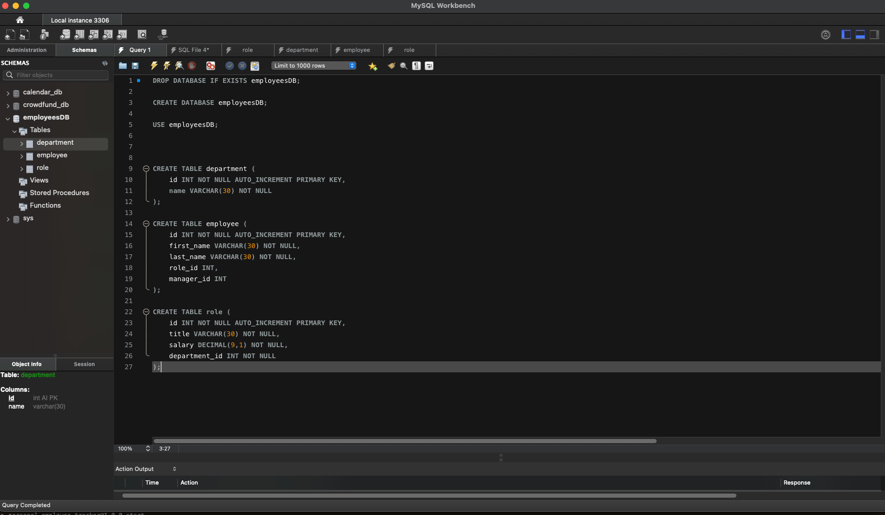
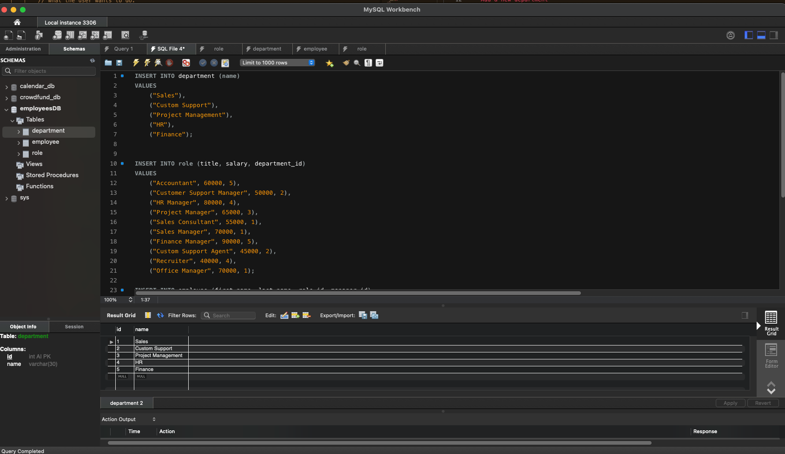
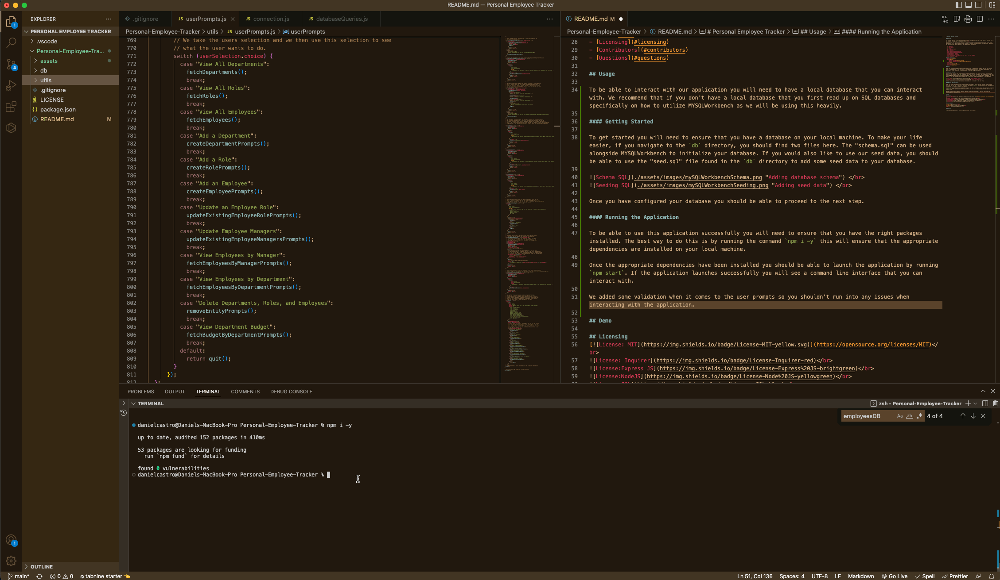
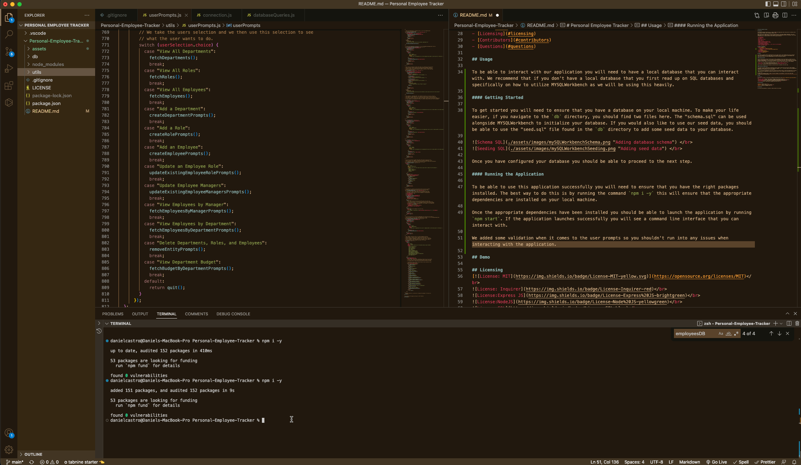

# Personal Employee Tracker

## Overview

The Personal Employee Tracker app is a simple command line application that allows users to interact with a SQL database to keep track of employee records.  

When utilizing this application, you will be interacting with three main elements employees, roles, and departments. All of these elements worked together to give you information about your employees. When using the application you should be able to see the following information: 

- All employees
- All departments
- All roles
- Add a new department
- Add a role
- Add an employee
- Update an existing employee role
- Update an existing employee manager
- View employees by manager
- View employees by department
- Delete an employee, department, or role record from the database
- View a department budget

## Table of Contents:
- [Overview](#overview)
- [Usage](#usage)
    - [Getting Started](#getting-started)
    - [Running the Application](#running-the-application)
- [Demo](#demo)
- [Licensing](#licensing)
- [Contributors](#contributors)
- [Questions](#questions)

## Usage

To be able to interact with our application you will need to have a local database that you can interact with. We recommend that if you don't have a local database that you first read up on SQL databases and specifically on how to utilize MYSQLWorkbench as we will be using this heavily. 

#### Getting Started

To get started you will need to ensure that you have a database on your local machine. To make your life easier, if you navigate to the `db` directory, you should find two files here. The "schema.sql" can be used alongside MYSQLWorkbench to initialize your database. If you would also like to use our seed data, you should be able to use the "seed.sql" file found in the `db` directory to add some seed data to your database.

  
  

Once you have configured your database you should be able to proceed to the next step.

#### Running the Application

To be able to use this application successfully you will need to ensure that you have the right packages installed. The best way to do this is by running the command `npm i -y` this will ensure that the appropriate dependencies are installed on your local machine. 

  

Once the appropriate dependencies have been installed you should be able to launch the application by running `npm start`. If the application launches successfully you will see a command line interface that you can interact with. 

  

We added some validation when it comes to the user prompts so you shouldn't run into any issues when interacting with the application. 

## Demo

## Licensing
 
 
 
 
 

## Contributors

**Author:** Daniel Castro  
**Github:** https://github.com/dcast0607  
**Email:** dancastro.java@gmail.com  

## Questions

If you have any questions or concerns, please contact me via email. 